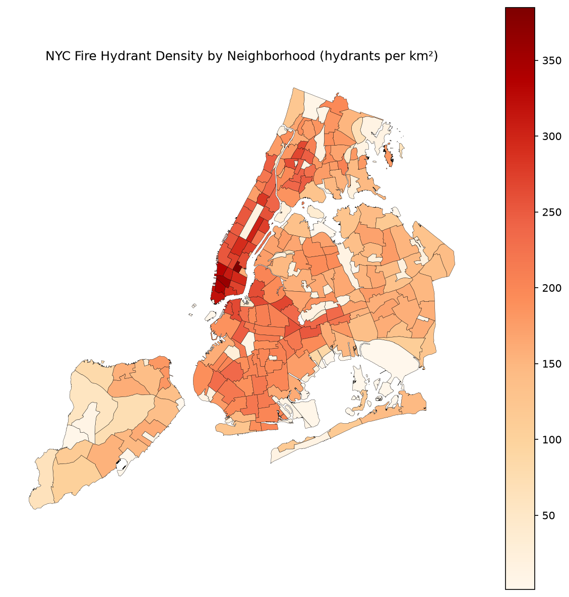

# NYC Fire Hydrant Density Analysis

## The question

Where is hydrant coverage densest in NYC, and which neighborhoods
are underserved relative to their area?

## The data

- **NYC Neighborhoods (NTAs):** 262 polygons, dataset `9nt8-h7nd` (NYC Open Data)
- **NYC Fire Hydrants:** 109,725 points, dataset `5bgh-vtsn` (NYC Open Data)
- License: NYC Open Data Terms of Use
- All source data in EPSG:4326

## Methodology

Built the same analysis twice:

- **SQL (PostGIS):** Five progressive queries in `analysis.sql` — Manhattan
  filter (sanity check), spatial join via `ST_Contains`, aggregate count per
  neighborhood, area-normalized density using `ST_Transform` to EPSG:2263
  (NY State Plane, feet; divisor 10,763,910 ft² per km²), and a buffer/union/
  intersection coverage analysis using EPSG:3857 (meters) for the 100m radius.
- **Python (GeoPandas):** Equivalent pipeline in `analysis.ipynb` using
  `read_postgis`, `sjoin`, `groupby`, `to_crs`, `.buffer()`, and `union_all()`.
  Produces a static choropleth and an interactive `.explore()` map. Final
  output exported to `data/processed/hydrant_density.parquet`.

Both pipelines produce identical density values to within rounding — confirmed
to four decimal places across all 259 neighborhoods.

## Findings

- **Raw counts mislead.** By raw hydrant count, the top neighborhoods are all
  large outer-borough areas: Annadale-Huguenot (Staten Island, 1,708 hydrants),
  Great Kills-Eltingville (1,672), Todt Hill (1,282). These neighborhoods simply
  have more land, not better coverage.

- **Density tells the opposite story.** Normalized by area, every top-10
  neighborhood is in Manhattan: Gramercy leads at 384.7 hydrants/km², followed
  by SoHo-Little Italy (360.0), Tribeca (343.3), and West Village (333.7).
  Small, dense neighborhoods pack far more hydrants per square kilometer than
  sprawling outer-borough ones.

- **Coverage analysis confirms the pattern — with a twist.** Using 100m buffers
  around each hydrant, Gramercy is 99.93% covered. But the least-covered
  neighborhoods are parks, cemeteries, and airports — Rockaway Community Park
  (1.2%), Fort Wadsworth (1.5%), and JFK Airport (1.9%). Large land areas with
  almost no buildings have almost no hydrants. The "underserved" framing
  requires context: hydrant density tracks residential density, not geographic
  area alone.

- **3 of 262 neighborhoods have no hydrants** and are excluded from join-based
  queries, producing 259 rows rather than 262 in the density and coverage
  results.

## What I learned

- **CRS units matter more than you'd think.** The brief specified EPSG:2263 for
  area calculations, but 2263 is NY State Plane in feet, not meters. Dividing
  by 1,000,000 (the square-meters divisor) would have produced density numbers
  off by a factor of ~10.76. Catching that before running the queries — and
  using the correct divisor of 10,763,910 ft²/km² — was a real lesson in
  reading CRS documentation rather than assuming.

- **SQL is dramatically faster for set-based spatial operations.** The PostGIS
  buffer/union/intersection query (Query 5) runs in a few seconds against
  109,725 hydrants. The equivalent GeoPandas loop took 47.7 seconds — because
  Python iterates through 262 neighborhoods sequentially rather than letting
  the database engine optimize the whole operation at once. This is the clearest
  argument I've seen for why spatial SQL exists as a discipline.

- **Every tool has its own language and its own context.** Early on I didn't
  have a clear mental model of which commands belonged where — SQL goes to
  psql, git and file commands go to bash, and Python goes to the notebook
  kernel. Once that separation clicked, debugging became much simpler: if
  something isn't working, the first question is whether it's even in the
  right place.

- **Writing queries to files instead of typing into interactive sessions works
  so much better.** Multi-line statements need to live in a file where they can
  be read, edited, and re-run cleanly with `psql -f filename.sql`. Keeping code
  in its proper home is what makes a project reproducible.

## Stack

- PostgreSQL 16 + PostGIS (via Docker, `kartoza/postgis:latest`)
- Python 3.14, GeoPandas 1.1.4, SQLAlchemy 2.0.51
- Data: NYC Open Data (Socrata API)

## Reproducing this analysis

\`\`\`bash
# 1. Start PostGIS
docker start gis_postgis

# 2. Run SQL analysis
PGPASSWORD=gis psql -h localhost -p 5432 -U gis -d gis -f analysis.sql

# 3. Install Python dependencies
pip install -r requirements.txt

# 4. Run notebook
jupyter lab analysis.ipynb
\`\`\`

Note: the NYC neighborhoods and hydrants data must already be loaded into
the PostGIS database. See the course data catalog for download instructions
using the Socrata API.
